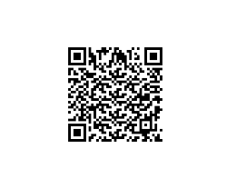

### Datasets

- [🍎 Apple Dataset](./apple/)
  - Description: Dataset containing images of various types of apples.
- [📄 Apple Dataset with XML Annotation](./appledataset/)
  - Description: Dataset in XML annotation format for experimentation with format changing.
- [🖼️ Apple Dataset with Images](./appledataset_with_img/)
  - Description: Dataset containing images of apples for CNN experimentation.
- [🚁 Drone Dataset](./appledataset/)
  - Description: Dataset for object detection containing images captured by drones.
- [📦 VOC Dataset](./appledataset/)
  - Description: VOC format dataset for experimentation with format changing.

### Models

- [🔗 Model 1](https://share.weiyun.com/d4PWOT67)
  - Description: Model 1 for download.
- Model 2
  - 
    - Description: QR code for downloading our CNN model (YOLOV1) for classification (class 6 experiment).
