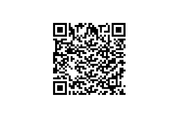

## Datasets 🍎🚁📦

- **🍎 Apple Dataset:**  [Apple Dataset](./apple/)
  - **Description:** Images of various apple types. 
- **📄 Apple Dataset with XML Annotation:** [Apple Dataset with XML Annotation](./appledataset/)
  - **Description:**  XML annotated dataset for format conversion experiments.
- **🖼️ Apple Dataset with Images:** [Apple Dataset with Images](./appledataset_with_img/)
  - **Description:** Images of apples for CNN experimentation.

**2. Drone Dataset** 🚁

- **🚁 Drone Dataset:** [Drone Dataset](./drone//)
  - **Description:**  Images captured by drones for object detection.

**3. VOC Dataset** 📦

- **📦 VOC Dataset:**[📦 VOC Dataset](./VOCdevkit/)
  - **Description:**  VOC format dataset for format conversion experiments.

## Models 🧠

**Model 1: YOLOv1 Model with Apple Dataset with Images** 🍎🧠

- **Model 1 Download:** [🔗 Model 1](https://share.weiyun.com/d4PWOT67)
  - **Description:**  Download the trained YOLOv1 model.

  
  - **Description:** QR code for downloading the CNN model (YOLOv1) for classification (CLASS 6 experiment).

**Model Parameters:** ⚙️

These parameters were used to train Model 1:

- `LEARNING_RATE = 3e-5`
- `DEVICE = "cpu"`
- `BATCH_SIZE = 32`
- `WEIGHT_DECAY = 0`
- `EPOCHS = 20`
- `NUM_WORKERS = 8` 

- **Model 2 Download:** [🔗 Model 2](https://share.weiyun.com/7dsljRk8)
  - **Description:**  Download the trained fast-r-CNN model.

  
  - **Description:** QR code for downloading the FAST-R-CNN model for classification (CLASS 7 experiment).

**Model Parameters:** ⚙️

These parameters were used to train Model 1:

- `n_epochs = 5`
- `lr=0.005`
- `momentum=0.9`
- `weight_decay=5e-4`
- `train_batch_size=4`
- `test_batch_size=4` 

